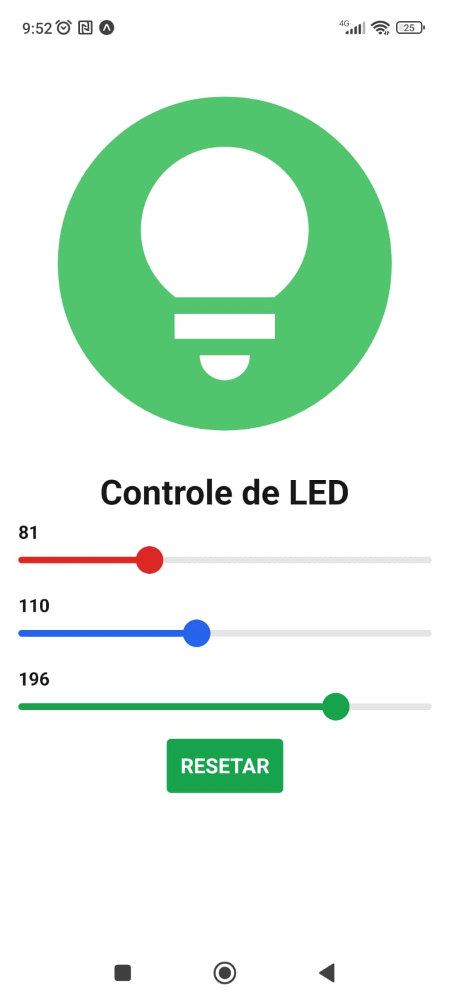

# RGB LED Controller

Aplicativo desenvolvido para controlar remotamente um LED RGB, permitindo ao usuário alterar a cor do LED em tempo real através de uma interface intuitiva no celular.

## ✨ Funcionalidades

- 🎨 Controle de cor do LED RGB usando sliders (vermelho, verde e azul)
- 📡 Comunicação via Wi-Fi/Bluetooth/HTTP (dependendo da implementação)
- 💡 Visualização em tempo real da cor selecionada
- 🔄 Atualização instantânea do LED conforme o usuário interage

## 🛠️ Tecnologias Utilizadas

- React Native
- Expo
- Axios
- ESP32

## 📱 Interface do App

A interface é composta por três sliders (R, G, B), onde o usuário pode ajustar os valores de cor entre 0 e 255. O app envia os dados ao microcontrolador, que ajusta o LED em tempo real.




## 📡 Como Funciona

1. O app se conecta ao ESP32 via rede local.
2. O usuário seleciona a cor desejada ajustando os sliders.
3. O app envia os valores RGB para o microcontrolador.
4. O LED RGB muda de cor com base nos valores recebidos.

## 🚀 Como Executar

### 🔧 Rodando em ambiente de desenvolvimento

1. Clone o repositório:
   ```bash
   git clone https://github.com/jabsonDevElias/appcontrolaled.git´´´
2. Instale as dependências:
   ```bash
   npm install´´´
3. Inicie o projeto com Expo:
   ```bash
   npx expo start´´´

4. Escaneie o QR Code com o app Expo Go no seu dispositivo Android/iOS para testar.

## ⚠️ Importante: Configurar o IP do Dispositivo

No arquivo app.tsx onde está a função `enviarCor()`, é necessário alterar o IP para o endereço IP do seu dispositivo (ESP32, por exemplo) conectado à mesma rede que o celular:

```js
function enviarCor() {
  axios.post('http://192.168.0.0/', {
    verde: cores[2].valor,
    azul: cores[1].valor,
    vermelho: cores[0].valor
  })
  .then(function (response) {
    console.log(response);
  })
  .catch(function (error) {
    console.error(error);
  });
}

🔁 Altere http://192.168.0.0/ para o IP do seu ESP32 ou servidor.
Você pode verificar o IP no monitor serial da IDE do Arduino ou usando ferramentas como o Fing no celular.

Exemplo:

axios.post('http://ipinformadopelomicroprocessador/', { ... });

---


